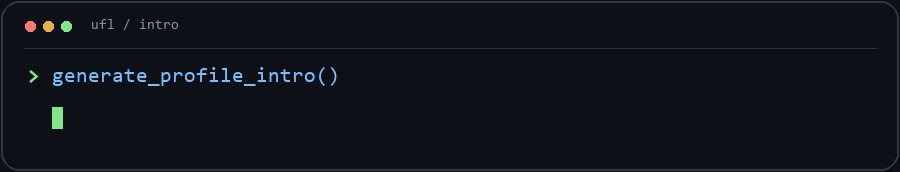
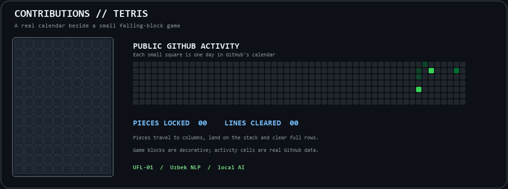

<h1 align="center">Abdulaziz Komilov</h1>

<strong>ML / LLM Engineer · Uzbek NLP · Agentic AI</strong> Tashkent, Uzbekistan

  <a href="https://huggingface.co/77terminator77">Hugging Face</a> ·
  <a href="https://www.linkedin.com/in/abdulaziz-komilov-3015b6433/">LinkedIn</a> ·
  <a href="mailto:rahimovabdelaziz@gmail.com">Email</a>

## About me

I build language-model pipelines and the applications around them: data preparation, tokenizer adaptation, continued pretraining, fine-tuning, evaluation, local inference, and tool-using agents. I founded UFL and have worked on independent ML/LLM projects since 2024, after freelance Python backend work. I also worked on applied LLM and computer-vision projects and taught technical topics at Digital City Andijan.

- Studying Artificial Intelligence at **INHA University in Tashkent**.
- Interested in Uzbek NLP, local deployment, multimodal workflows, and reliable agent behavior.
- Comfortable working from the **CLI**, in **Docker**, with **Kubernetes clusters and pods**, on **RunPod GPU pods**, and in **Jupyter** notebooks.

## Current focus

| UFL-01 model | UFL agent runtime | Evaluation |
| --- | --- | --- |
| Uzbek-language LLM project based on Gemma 4 E2B. Tokenizer adaptation and CPT are complete and evaluated; chat and tool-use SFT are in progress. Agentic and multimodal capability are development goals. | A local desktop agent with tool routing, workspace controls, and confirmations. The public [UFL repository](https://github.com/menma4ever/UFL) contains the runtime, not the model checkpoint. | Dataset QA, loss and checkpoint comparison, regression checks, and evidence-backed claims. |

## Libraries, tools & platforms

**Model development**

**Training & inference**

**Agents & infrastructure**

I also work with **OCR and image-text data**, **SQL/SQLite**, **REST APIs**, **Git/GitHub**, **Bash/PowerShell**, and **local model serving**.

## Selected work

- **[UFL](https://github.com/menma4ever/UFL)** — local Uzbek-language desktop agent and tool runtime.
- **[Agentic Team MCP](https://github.com/menma4ever/agentic-team-mcp)** — manager and worker orchestration with persistent state and a web interface.
- **[RelayCanvas](https://github.com/menma4ever/relaycanvas)** — visual multi-agent workflow builder with live traces.

## Contributions in Tetris style

The small calendar uses GitHub contribution data. The game board is decorative: its pieces do not represent commits. [See how the daily animation is generated](.github/workflows/contribution-tetris.yml).

---

Interested in Uzbek NLP, local AI, or dependable agents? <a href="mailto:rahimovabdelaziz@gmail.com">Get in touch.</a>

